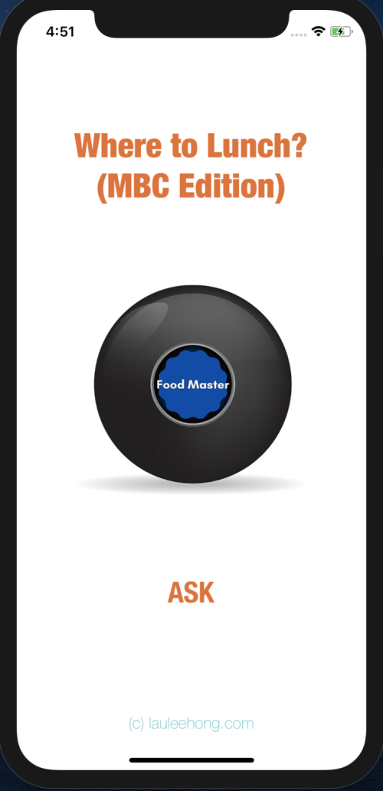

# lunch.rand()

## The Problem

"Lunch?, where to?". Does this happen commonly among your workplace? Well, I encountered it almost on a daily basis. Employees spend 5-10mins each day comtemplating where to have lunch each day, which results in hours of productivity lost each month.

## What is lunch.rand()

This iOS (supports 13.0 and above) app is a lunch spot randomizer app. It is inspired from Angela Yu's (@angelabauer) Magic 8 Ball app. Tap on "Ask", and a magic ball with the lucky lunch spot would appear.

This initial version works for Mapletree Business City in Singapore.

## What's Next

This is an initial version of the app. Future expansions include:
1. Allowing users to add new lunch spots
2. Supporting multiple business zones
3. Using GPS coordinates to find the nearest business zone near the user
